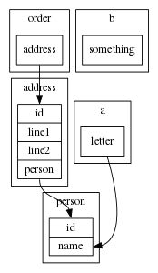

# DiaYAML

Draw database diagrams using GraphViz / DOT from a very simple YAML file.

## Example YAML File

``` yaml
    person: # A Table
        name: # A Field
    address:
        line1:
        line2:
        person: # Link adds a foreign key (missing field implies `id`, will be added if not already existing!)
        link: person
    order:
        address: address # Shorter version of a foreign key
    a:
        letter:
            link: person.name # A foreign key to a specific field
    b:
        id:
        something:
```

## Example Output



## Usage

    Output a GraphViz / Dot file from a simplified YAML file
  
    Usage
  
    --help            Print usage instructions
    --file <array>    The input file (there can be many, but only the first will be
                      read!)
    --json            Use a JSON file instead of the default YAML
  
  
    YAML Usage:
  
      node index.js test/dbdiagram.yaml | dot -Gdpi=64 -Tpng:cairo:cairo > bin/dbdiagram.png && display.im6 bin/dbdiagram.png
  
    JSON Usage:
  
      node index.js --json test/dbdiagram.json | dot -Gdpi=64 -Tpng:cairo:cairo > bin/dbdiagram.png && display.im6 bin/dbdiagram.png

